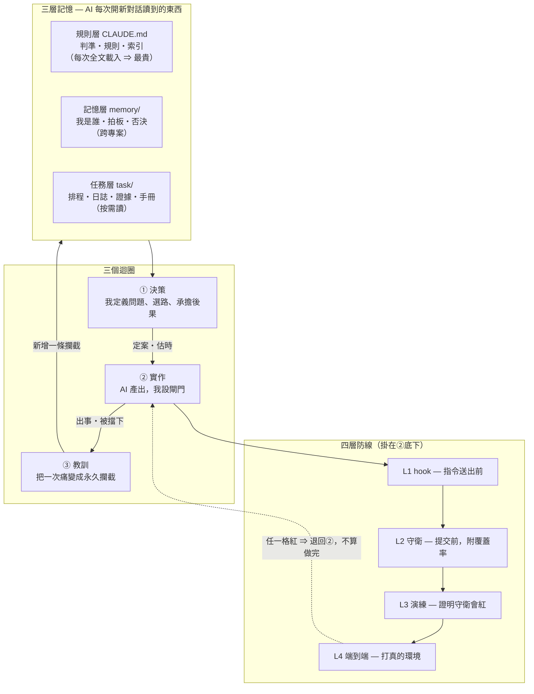

# 01 — 全貌：三層記憶 × 四層防線

上一層：[README](README.md)　下一層：[02 規則層](02-rules-file.md)

---

## 為什麼是「三層記憶」

AI agent 每開一個新對話就失憶。你有三種東西要交給它，而它們的**生命週期完全不同**：

| 層 | 存的是 | 生命週期 | 誰寫 | 載入方式 |
|---|---|---|---|---|
| **規則層**（`CLAUDE.md`） | 這個 repo 的規矩與判準 | 跟著 repo 走 | 我 ＋ AI 協作 | **每次對話全文載入** |
| **記憶層**（`memory/`） | 我是誰、拍板過什麼、否決過什麼 | 跟著「我」走，跨專案 | AI 主動寫、我校正 | 索引常駐、內容按需撈 |
| **任務層**（`task/`） | 現在在做什麼、做完了嗎、發生過什麼 | 跟著時間走，會換季 | 我 ＋ AI，每次交付 | **按需讀，不進預設上下文** |

**把三者混在一起是最常見的錯誤。** 混了之後的症狀很具體：

- 把任務進度寫進規則檔 ⇒ 每次對話都付那幾行的成本，而且它三天後就過期。
- 把規矩寫進記憶 ⇒ 換一台機器、換一個 agent 就不見了，而且新來的人看不到。
- 把決策寫進日誌 ⇒ 三週後有人（包括你自己）再提一次同一個被否決的方案。

---

## 為什麼是「四層防線」

因為**綠燈會騙人**，而且有五種騙法（見 [05](05-guards.md)）。四層的分工是：

```
L1 hook      指令送出「之前」就擋      ← 執行環境跑，你想忘也忘不掉
L2 守衛      提交「之前」擋            ← 你跑，但 PASS 只印一行
L3 演練      證明 L2 真的會紅          ← 壞掉的守衛跟正常的守衛長得一模一樣
L4 端到端    證明它在「真的環境」成立   ← 本機綠只證明邏輯沒壞
```

⚠️ **L3 不是可選的。** 一支守衛可以用五種不同的方式報假綠燈，而終端機上完全看不出來。
沒有 L3 的話，你的 L2 有可能從第一天起就什麼都沒在擋。

---

## 全貌圖



**讀法**：三層記憶餵給三個迴圈；四道閘門掛在②底下，任何一道紅燈都把工作推回②；
③的產出不是一份檢討報告，是**三層記憶裡多出來的一條規則、或多出來的一支機器檢查**。

---

## 一次完整循環的細節圖

```text
┌─ ① 決策迴圈｜我做的：定義問題、選路、承擔後果 ───────────────────────────┐
│                                                                            │
│   我：一句需求                                                             │
│      │                                                                     │
│      ▼                                                                     │
│   ┌────────────────────┐   先查再寫（HARD RULE） ┌──────────────────────┐  │
│   │ 先問：這句話在回答  │ ──────────────────────►│ 擴充點索引            │  │
│   │ 哪一個問題？        │                         │ ＋ grep 至少 3 個同義詞│  │
│   │ ⇒ 答案就是它的家    │                         │   （中英文都要試）     │  │
│   └─────────┬──────────┘                         └──────────┬───────────┘  │
│             │                                                │             │
│             │       回覆開頭必須印出二選一 ◄─────────────────┘             │
│             │       「既有可複用項：EXT-xx」／「查無，新寫理由＝…」          │
│             │       🚨 沒印出來就是沒查 —— 把不可觀測的內部行為變成產出     │
│             ▼                                                              │
│   ┌──────────────────────────────────────────────────────────┐             │
│   │ AI 出【計畫＋估時】，**不出 code** ← 我的時間只花在這裡    │             │
│   │ 理由：計畫階段的錯誤改一行字，實作階段的錯誤改三個檔案      │             │
│   └─────────┬────────────────────────────────────────────────┘             │
│             │ 我裁示（採用／否決／改範圍）                                  │
│             │ 🚨 被否決的方案**不刪**，收進作廢紀錄 ⇒ 防重議                 │
│             ▼                                                              │
│   排程表：還要花多少時間（唯一權威）                                        │
│   決策紀錄：只留還在管事的，每條 ≤5 行                                      │
└──────────────────────────────┬─────────────────────────────────────────────┘
                               │ 定案的東西才准動手
                               ▼
┌─ ② 實作迴圈｜AI 跑，我設閘門：閘門沒過就不算做完 ─────────────────────────┐
│                                                                            │
│   先改規格、再改 code                                                       │
│   （規格與 code 衝突時**以 code 為準**，然後回頭改規格                      │
│     —— 權威是跑得起來的東西，不是散文）                                     │
│        │                                                                   │
│        ▼                                                                   │
│   AI 改 code                                                               │
│        │                                                                   │
│        ▼                                                                   │
│   【L1 hook】執行環境跑 ⇒ 我想忘也忘不掉，不觸發時 0 上下文成本              │
│        · 指令送出前攔截：管線吃掉 exit code／資料庫目標沒指定／              │
│          啟動參數會靜默換掉資料庫／提交前掃機密                             │
│        · 檔案寫入後檢查：語法／敏感內容寫錯目錄／雙平台同步提醒              │
│        · 另一半掛在 git 原生 pre-commit                                     │
│          ⇒ **不管誰、從哪個終端機提交都會跑**                               │
│          （agent 的 hook 只在 AI 下指令時觸發，補的就是這個縫）              │
│        ▼                                                                   │
│   【L2 守衛】`tools/*.py`，我跑；**PASS 只印 1 行，原始碼永不進上下文**      │
│        規格與 code 對不對得上・索引有沒有說謊・權限檢查漏掛沒有・            │
│        跳脫有沒有漏・資料庫保留字・數值有沒有漂移                           │
│        🚨 判準：綠燈必須印「我驗到了幾個」。驗 0 個然後 PASS ＝「沒去看」    │
│        ▼                                                                   │
│   【L3 演練】`*_drill.py` ⇒ **證明守衛真的會紅**                            │
│        注入假故障 → 確認 FAIL → try/finally 還原 → 逐位元組比對還原乾淨      │
│        🚨 必含**反向案例**，否則一支「全部擋掉」的守衛也會拿滿分            │
│        ▼                                                                   │
│   【L4 端到端】真瀏覽器 ＋ 真資料庫                                         │
│        本機（快，約 1 分）→ 真 PostgreSQL（慢，約 35 分）→ 才准部署          │
│        🚨 本機綠只證明「邏輯沒壞」，不證明「schema／型別／外鍵在真環境成立」 │
│        🚨 而且要在**兩種資料狀態**下各跑一次：空庫與有資料                   │
│        ▼                                                                   │
│   交付登記（**同一個工作階段內**，不是可選收尾）                            │
│        排程表整列移出 ／ 日誌補敘事 ／ 證據帳本補一列帶實測數字 ／ 索引更新   │
└──────────────────────────────┬─────────────────────────────────────────────┘
                               │ 出事的時候（症狀通常是「畫面全對」）
                               ▼
┌─ ③ 教訓迴圈｜核心資產：把一次痛變成永久的攔截 ───────────────────────────┐
│                                                                            │
│   踩到 ──► 問「**結構原因**是什麼」，不是「我下次會小心」                    │
│        │    （「下次小心」不可證偽，所以它擋不住第二次）                     │
│        ▼                                                                   │
│   事故記錄（每篇＝症狀／結構性根因／**現在誰接住它**）                       │
│        │                                                                   │
│        ├─ 機器接得住嗎？                                                   │
│        │   ├ 指令樣式／檔案事件／時間 ─────► 加一條 hook ＋ 正反向演練       │
│        │   ├ 「做完了也不會知道出錯」 ─────► 加一支守衛 ＋ 故障演練         │
│        │   └ 只能靠判斷 ──────────────────► 規則正文（最貴，只留這一類）    │
│        ▼                                                                   │
│   下一次同型錯誤**在發生的當下**被擋下來，                                  │
│   而不是在上線那天被使用者發現                                              │
└────────────────────────────────────────────────────────────────────────────┘
```

---

## 三個迴圈各自的產出

| 迴圈 | 我做什麼 | AI 做什麼 | 產出落在哪 |
|---|---|---|---|
| ① 決策 | 定義問題、裁示、承擔後果 | 查索引、出計畫、報估時 | 排程表 ＋ 決策紀錄 ＋ 作廢紀錄 |
| ② 實作 | 設閘門、驗收 | 改規格、改 code、跑守衛 | code ＋ 規格 ＋ 證據帳本 |
| ③ 教訓 | 問「結構原因是什麼」 | 寫事故記錄、把規則往下推一層 | hook ／ 守衛 ／ 規則正文 |

> **①和③是我的，②可以外包。** 這就是「AI 時代工程師會什麼」的答案：
> 不是「我能默寫框架語法」，是「我知道這個系統會在哪裡安靜地壞掉，而且我把它變成了機器檢查」。

---

## 接下來

- 規則層怎麼寫（含瘦身判準）→ [02-rules-file.md](02-rules-file.md)
- 記憶層五分類 → [03-memory.md](03-memory.md)
- 任務層六個檔 → [04-task-files.md](04-task-files.md)
- 四層防線的實作細節 → [05-guards.md](05-guards.md)
